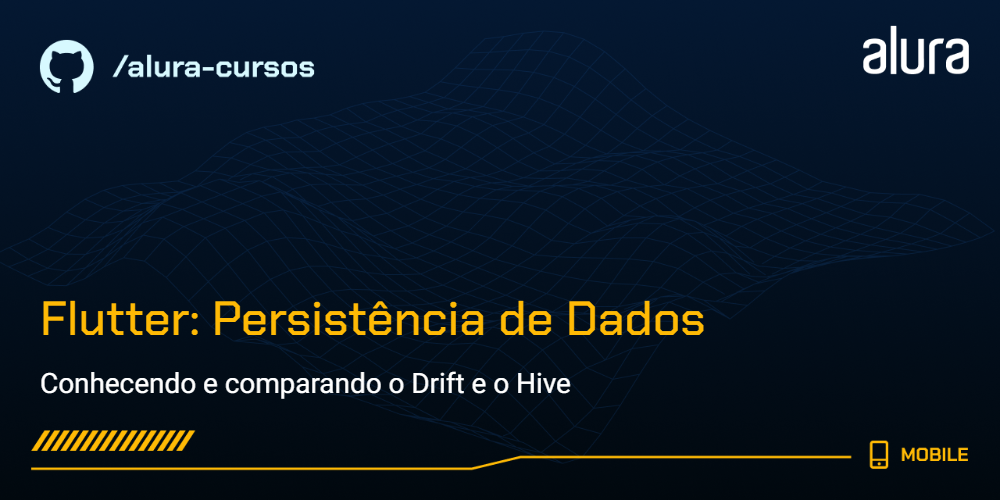
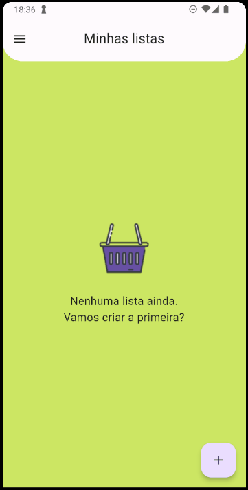

# Flutter: Persistência de dados com Drift e Hive

O projeto Listin é um gerenciador de listas de compras para que você possa planejar sua feira e, no supermercado, possa anotar quanto já gastou para evitar surpresas na hora do caixa!

### Tópicos abordados no curso:

- O que é persistência de dados;
- Banco de dados relacional e não relacional;
- Como instalar e configurar o Drift;
- Operações básicas usando o Drift;
- Como instalar e configurar o Hive;
- Operações básicas usando o Hive;

Este curso é indicado para pessoas que já tem um bom conhecimento de Dart e Flutter e desejem tornar suas aplicações funcionais com o armazenamento local de informações usando duas das ferramentas mais confiáveis do mercado;

## 📑 Requisitos

- Conhecimentos básicos de Flutter e Dart;
- VS Code com plugins do Flutter e Dart instalados (recomendado para acompanhar este curso);
- É importante ter o Flutter na versão 3.16.9.

## ✨ Funcionalidades do projeto

- Configuração do Drift no Flutter;
- Implementação da adição, leitura, edição e remoção de "Listins" usando o Drift;
- Configuração do Hive no Flutter;
- Implementação da adição, leitura, edição e remoção dos produtos usando o Hive;

## 🛠️ Abrir e rodar o projeto

Aqui vem um passo a passo para abrir e rodar o projeto.

- **Open an Existing Project** (ou alguma opção similar)
- Procure o local onde o projeto está e o selecione (Caso o projeto seja baixado via zip, é necessário extraí-lo antes de procurá-lo)
- Por fim clique em OK
- Depois basta rodar o comando `flutter run` na pasta do projeto